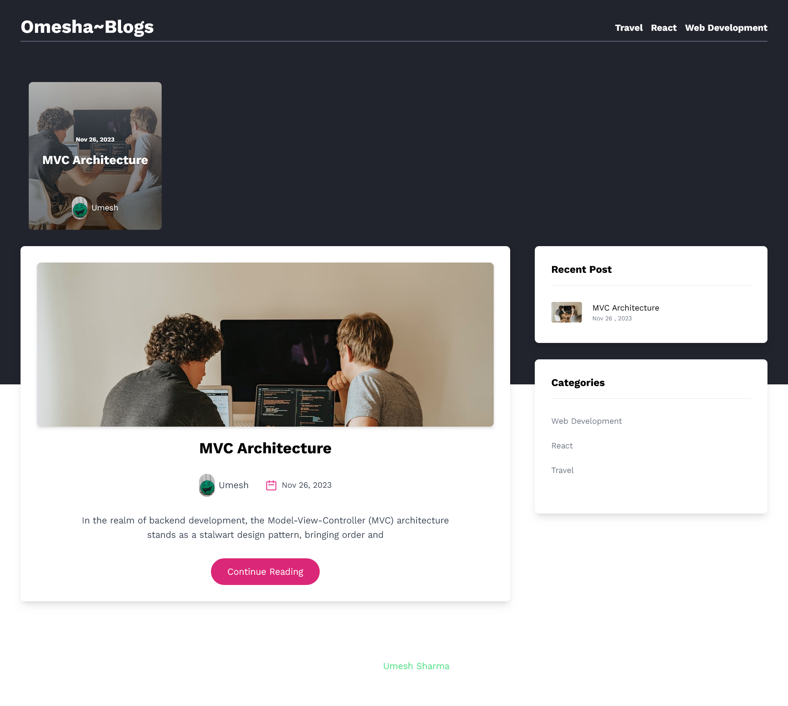

## BLoGging Website using Next.js Tailwind CSS and GraphCMS.

A FullStack Blogging web application Created with Next.js and Graphql using GraphCMS

### ScreenShot

### Links

- Live Site URL: [UmeshBlogs](https://umeshblogs.vercel.app/)

## Features

- Featured Posts
- Recent Post
- Categories
- Related Posts
- Author Information
- Comments
- Comments Reviews By Author Before Publishing.

### Built with

- [Next.js](/) - React framework
- Tailwind CSS
- GraphQl
- Mobile-first workflow
- [React](https://reactjs.org/) - JS library

### Useful resources

- [Next.js](https://nextjs.org)
- [GraphQl](https://graphql.org/)
- [hygraph CMS](https://hygraph.com/)

## Author

- Website - [Umesh](https://umesharma.netlify.app/)

- Twitter - [@Omesha_Sh](https://www.twitter.com/@Omesha_Sh)
